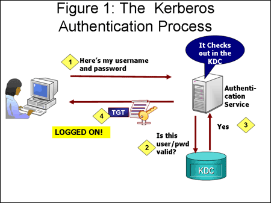

% Kerberos Service
% Tania Gabriela Bonilla Alvarenga
% 2018/05/23

---


---

## Introduction

Kerberos is a network authentication protocol that provides strong authentication for client/server applications using secret-key cryptography.

Kerberos was created by MIT (Massachusetts Institute of Technology) as a solution to the problems across an insecure network connection.

---

## Introduction

* Kerberos Tickets
* Kerberos Database
* Kerberos Realms
* Ticket Granting Ticket
* Network Services and Master Database

	host/laughter.mit.edu@ATHENA.MIT.EDU

* Keytab File
* User/Kerberos Interaction


---



---


---

## Backend Classic

#### Server Kerberos

Manipulation and treatment of the kerberos database

* Kadmin/kadmin.local
* Date Format
* Principals
* Policies
* Global operations

---

## Backend Classic

### Model 1 - Client Unix/PAM

Process of the kerberos authentication of a user Unix having the account information in a server LDAP and the password in the Kerberos Server.

```bash
$ su - user
Password: kerberos_password
Creating directory '/tmp/home/user'.
-sh-4.3$ pwd
/tmp/home/pau
```

---

## Backend Classic

### Model 2 - Ssh Kerberized

The use of the service SSH using kerberos credentials instead of a local/unix password fot the user authentication.

```bash
[root@kclient docker]# kinit tania
Password for tania@EDT.ORG: ktania
```

---

## Backend Classic

### Model 2 - Ssh Kerberized

```bash
 [root@kclient docker]# ssh tania@ksshserver
The authenticity of host 'ksshserver (172.11.0.4)' can't be established.
ECDSA key fingerprint is SHA256:BSe2q+Ce8nKbsMCd+QHhpY25TdUDgnGaiNeF4AItyPA.
ECDSA key fingerprint is MD5:12:90:86:11:ee:20:1f:d1:bf:0b:12:aa:cf:9a:33:31.
Are you sure you want to continue connecting (yes/no)? yes
Warning: Permanently added 'ksshserver,172.11.0.4' (ECDSA) to the list of known hosts.
[tania@ksshserver ~]$ logout
Connection to ksshserver closed.
```

---

## Backend Classic

### Model 3 - FTP with kerberos authentication

Server FTP use kerberos for clients authentication(with module pam_krb5).

Having the principal in the kerberos database it's possible to use the service FTP even without a unix password.

```bash
[root@kftp docker]# useradd tania
 
[root@kclient docker]# ftp 172.11.0.5
Connected to 172.11.0.5 (172.11.0.5).
Trying ::1...
Connected to localhost (::1).
220 Welcome to FTP service, password kerberos.
Name (localhost:root): tania
331 Please specify the password.
Password: ktania
230 Login successful.
```

---

## Backend Classic

### Model 3 - FTP with kerberos authentication

```bash
Remote system type is UNIX.
Using binary mode to transfer files.

ftp> ls
229 Entering Extended Passive Mode (|||27840|)
150 Here comes the directory listing.
226 Directory send OK.

ftp> get /var/ftp/prova01.txt filetania.txt
local: filetania.txt remote: /var/ftp/prova01.txt
227 Entering Passive Mode (172,11,0,11,24,0).
150 Opening BINARY mode data connection for /var/ftp/prova01.txt (14 bytes).
226 Transfer complete.
14 bytes received in 0.000214 secs (65.42 Kbytes/sec)

ftp> quit
221 Goodbye.
```

---

## Backend Classic

### Model 4 - Imap with kerberos authentication

Servei IMAP use kerberos for clients authentication (with module pam_krb5).
Note that the principal must exist in kerberos database.

```bash
[root@kimapserver docker]# telnet localhost 143
Trying ::1...
Connected to localhost.
Escape character is '^]'.
* OK [CAPABILITY IMAP4REV1 I18NLEVEL=1 LITERAL+ SASL-IR LOGIN-REFERRALS STARTTLS] localhost IMAP4rev1 2007f.404 at Wed, 16 May 2018 09:47:02 +0000 (UTC)
```

---

## Backend Classic

### Model 4 - Imap with kerberos authentication

```bash
a login pere kpere
a OK [CAPABILITY IMAP4REV1 I18NLEVEL=1 LITERAL+ IDLE UIDPLUS NAMESPACE CHILDREN MAILBOX-REFERRALS BINARY UNSELECT ESEARCH WITHIN SCAN SORT THREAD=REFERENCES THREAD=ORDEREDSUBJECT MULTIAPPEND]

User pere authenticated

a logout
* BYE kimapserver IMAP4 rev1 server terminating connection
a OK LOGOUT completed
Connection closed by foreign host.
```


---

## Backend LDAP

### Model 5 - Server Kerberos using backend LDAP
	
Server Kerberos with an LDAP server as backend. This means Kerberos database is stored in a LDAP Server (using a special schema for kerberos principals).

```bash 
[root@krbldap docker]# ldapsearch -x -LLL dn
dn: dc=edt,dc=org
...
dn: cn=krbldap.edt.org,dc=edt,dc=org
dn: cn=EDT.ORG,cn=krbldap.edt.org,dc=edt,dc=org
```

---

## Backend LDAP

### Model 5 - Server Kerberos using backend LDAP

```bash
dn: krbPrincipalName=K/M@EDT.ORG,cn=EDT.ORG,cn=krbldap.edt.org,dc=edt,dc=org
dn: krbPrincipalName=krbtgt/EDT.ORG@EDT.ORG,cn=EDT.ORG,cn=krbldap.edt.org,dc=edt,dc=org
dn: krbPrincipalName=kadmin/admin@EDT.ORG,cn=EDT.ORG,cn=krbldap.edt.org,dc=edt,dc=org
dn: krbPrincipalName=kadmin/krbldap.edt.org@EDT.ORG,cn=EDT.ORG,cn=krbldap.edt.org,dc=edt,dc=org
dn: krbPrincipalName=kiprop/krbldap.edt.org@EDT.ORG,cn=EDT.ORG,cn=krbldap.edt.org,dc=edt,dc=org
dn: krbPrincipalName=kadmin/changepw@EDT.ORG,cn=EDT.ORG,cn=krbldap.edt.org,dc=edt,dc=org
dn: krbPrincipalName=kadmin/history@EDT.ORG,cn=EDT.ORG,cn=krbldap.edt.org,dc=edt,dc=org
dn: krbPrincipalName=taniaprova@EDT.ORG,cn=EDT.ORG,cn=krbldap.edt.org,dc=edt,dc=org
dn: krbPrincipalName=tania/admin@EDT.ORG,cn=EDT.ORG,cn=krbldap.edt.org,dc=edt,dc=org
dn: krbPrincipalName=tania@EDT.ORG,cn=EDT.ORG,cn=krbldap.edt.org,dc=edt,dc=org
```

---


## Thanks for your attention!

		Escola del Treball - HISX2
		2018/05/23
